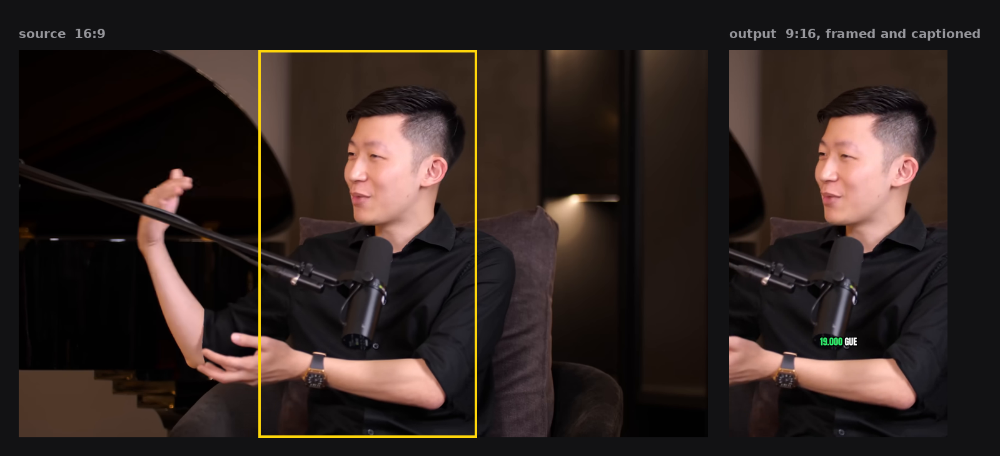

# AI Clipper

Automated tool that turns a long-form video (podcast, interview, talk) into
short-form clips: highlight detection, hook scoring, subtitles, and
multi-format export. Built as a portfolio project, inspired by paid clipper
apps like SOCL Visuals but with two twists those tools don't have:

1. **Hook scoring is a real, explainable NLP pipeline**, not a single "ask an
   LLM which part is good" call. Every score comes with the list of signals
   that fired (opening question, curiosity marker, contrarian statement,
   numbers, topic distinctiveness, etc.) and their weights.
2. **Speaker framing works from a single wide camera angle.** Most clippers
   only do split-view when the source footage happens to have multiple
   camera angles. This one detects faces in one frame and can synthesize a
   split-view (or single-speaker crop) from a single static shot, which
   matches how most independent podcasters actually record.



One frame from a real run. The yellow box is the window the tracker chose for
that shot; the right-hand panel is what came out, captions and all. Nothing in
the figure is mocked up: the box position was recovered by matching the output
back against the source frame.

## Status

| # | Milestone | Status |
|---|---|---|
| 1 | Project scaffold | done |
| 2 | NLP hook-scoring module | done |
| 3 | ASR transcription (Whisper) | done |
| 4 | Clip cutting + subtitle burn-in | done |
| 5 | CV face-tracked framing | done |
| 5b | Split-view from a single wide shot | done |
| 6 | Multi-format + platform-aware export | done |
| 7 | End-to-end pipeline + packaging | done |

## Install

```bash
pip install .
```

That puts two commands on the path and carries the bundled fonts with them, so
an installed copy renders exactly what a checkout does:

```bash
ai-clipper-transcribe "podcast.mov" --model large-v3 --device cuda --lexicon lexicon.json
ai-clipper "podcast.mov" transcript.json -o out --clips 15
```

Rendering also needs **ffmpeg** on the PATH, which is not a Python package:
`winget install Gyan.FFmpeg` on Windows, `brew install ffmpeg` on macOS,
`apt install ffmpeg` on Linux. Transcription does not need it; faster-whisper
brings its own copy of the ffmpeg libraries through PyAV.

**While working on the code, install it editable instead:**

```bash
pip install -e ".[dev]"
```

`pip install .` copies the source into site-packages, so `ai-clipper` keeps
running whatever it copied and edits to `src/` do nothing. That is easy to miss,
because nothing fails: the command still works, it is just running last week's
code. It cost one wrong render and one confused round trip to notice.

Working from a clone without installing anything works too, and the two scripts
at the top level are there for exactly that:

```bash
pip install -r requirements.txt
python transcribe_local.py "podcast.mov" --model large-v3 --device cuda
python run_pipeline.py "podcast.mov" transcript.json -o out --clips 15
```

`transcribe_local.py` goes looking for the project's `src/` from wherever it is
run, because in practice it gets run from the folder the video is in.

## What works right now

Video in, ready-to-post clips out.

```bash
ai-clipper "podcast.mov" transcript.json -o out --clips 5 \
       --platforms tiktok,reels,shorts
```

Add `--dry-run` to pick the clips and print where each one starts and ends
without touching the video. Rendering fifteen clips across three platforms takes
about fourteen minutes; every question about a clip's *boundaries* is answerable
from the transcript alone, and that takes under a minute.

```bash
ai-clipper "podcast.mov" transcript.json -o out --clips 15 --dry-run
```

A dry run deliberately imports no OpenCV and no PyAV. It is the loop that gets
run most often, and it should work on a machine with nothing but Python and
numpy.

Both entry points take a link in place of a path:

```bash
ai-clipper-transcribe "https://youtu.be/..." --model large-v3 --device cuda
ai-clipper "https://youtu.be/..." downloads/<id>_transcript.json -o out
```

Downloads are capped at 720p - the analysis runs at 480-640px and renders at
720p or 1080p, so fetching 4K of a three-hour episode costs gigabytes and buys
nothing - and a file already downloaded is reused instead of fetched again.

That writes, per clip and per platform: the rendered `.mp4`, the editable `.ass`
subtitle file behind it, a `_caption.txt` with a suggested title, description
and hashtags, a `_cover.jpg` taken from a settled moment with a readable line on
screen, and one `run_report.json` recording every decision - which candidates
were scored, why each clip won, which framing mode was chosen and on what
evidence, where the captions were placed, how much dead air came out, and what
the audio was moved by.

The video analysis is cached in the output folder, so re-running with different
platforms, styles or clip counts skips straight to rendering.

Every option, every file the run writes and the shape of each JSON in it are in
[docs/interface.md](docs/interface.md). That is the reference for building
something against this rather than reading the source first.

The command is a thin shell around a function, so a UI does not have to read
printed lines back:

```python
from ai_clipper.core import Settings, run

result = run(Settings(video="podcast.mov", transcript="transcript.json", clips=15),
             on_progress=lambda event: print(event.kind, event.data),
             should_stop=lambda: user_pressed_stop)
```

`core.py` prints nothing, and there is a test that says so. Every point the
command prints is an event carrying both the line a terminal wants and the
numbers a program wants, so `cli/pipeline.py` is one function that prints
`event.message` while a UI switches on `event.kind` and reads `event.data`.

Stopping is asked between files rather than forced. Renders are atomic and the
session is written as each file lands, so a stopped run is a resumable one:
measured on a three-clip render, stopping after two left no partial file behind
and the next run encoded only the third.

To look at scoring on its own, with no video and no model:

```bash
python demo_scoring.py
```

Run tests:

```bash
pip install -e ".[dev]"
python -m pytest -q
```

## Platform-aware export

One clip, several destinations, and each app covers a different part of the
frame with its own interface. `export/platforms.py` holds a safe area per
platform and repositions the captions accordingly - the look you chose is left
alone, only the margins move.

| platform | ratio | caption bottom margin | side clearance | duration cap |
|---|---|---|---|---|
| TikTok | 9:16 | 0.23 | 0.17 | 10 min |
| Instagram Reels | 9:16 | 0.25 | 0.16 | 3 min |
| YouTube Shorts | 9:16 | 0.20 | 0.16 | 3 min |
| Instagram feed | 4:5 | 0.09 | 0.03 | 90 s |
| Square | 1:1 | 0.09 | 0.03 | none |
| YouTube landscape | 16:9 | 0.13 | 0.03 | none |

Side margins are symmetric, which took a wrong turn to arrive at. TikTok and
Reels put their button column down the right edge only, so an earlier version
shifted captions left of frame centre to clear it. Correct on paper, wrong on
screen: off-centre subtitles read as a mistake in every frame, while the button
column only sometimes overlaps anything.

What survives is the useful half. The interface column still narrows the
caption's usable width on both sides, so long lines wrap instead of running
under the buttons, and the block stays centred. Vertical clearance costs nothing
visually and stays per platform. `CaptionStyle` keeps per-side margins for
anyone who wants them; no platform sets them.

Clips too long for a platform are skipped before rendering rather than after,
and the run says which and why. `--no-safe-area` turns the whole thing off.

## Signals: the language-specific half

Every word list started out written into the middle of `hook_scorer.py`, which
meant adapting the tool to a cooking podcast or another language was a Python
edit. They now live in `scoring/signals.py`, and a `signals.json` next to the
project overrides or extends any of them, the same way `styles.json` works for
captions.

```json
{
  "name": "indonesian-kesehatan",
  "extends": "indonesian",
  "markers": {
    "+stakes": ["komplikasi", "kambuh", "operasi", "vonis"],
    "intensity": ["parah", "banget", "ngeri"]
  },
  "weights": { "stakes": 1.5 },
  "thresholds": { "closing_window": 14.0 }
}
```

A bare bank name replaces that list; a `+` prefix adds to it. Weights and
thresholds are patched, not replaced, so naming one leaves the rest alone. An
unknown bank is ignored rather than fatal, so a file written for a later version
still loads here minus what this build does not understand. Copy
`signals.example.json` to start.

**The split follows a seam that was measured, not guessed.** Running two
one-hour episodes from different domains through the same code:

| layer | what it is | how well it travelled |
|---|---|---|
| structure | a clip must not stop mid-question, must not cross a subject boundary, must open on a line that stands alone | carried over intact |
| vocabulary | which words mean stakes, curiosity, a question, a promise | `stakes` fired on 80% of candidates in one and 53% in the other |

Structure stayed in code because it is about how conversation works. Vocabulary
moved out because it is about who is talking and what about. Nothing below the
vocabulary line knows a single Indonesian word any more, and the whole
fifteen-clip selection on the test episode came out byte-identical after the
move, which is the only real proof that a refactor was a refactor.

## Caption packs

Every clip ships with `clip_NN_caption.txt`: a hook line pulled from the clip's
opening, a suggested title, a description, hashtags built from the clip's own
topic words, and the scoring explanation. Thirty clips means thirty sets of
copy, which is the part of clipping that actually takes an afternoon.

It is all rule-based and offline, and every file says it is a draft. Suggesting
a title is useful; pretending it is finished copy is not. One detail worth
knowing: a question only becomes the hook if it carries real content, because
conversational backchannel is grammatically a question and an earlier version
cheerfully titled a clip "Betul ya".

Whisper also splits a number at its separator, so "19.000" arrives as the two
words "19" and ".000" and the renderer, joining words with spaces, burned
`19 .000` onto the screen. It survived every run until someone looked closely at
a single frame for the figure at the top of this file. Two cases are rejoined
now, both safe: a fragment that starts with a separator followed by a digit, and
a token that is nothing but punctuation. The merged word keeps the first start
and the last end, so the karaoke highlight still covers exactly as long as the
speaker took to say it.

## Caption styles

Three presets ship as starting points: `clean`, `punch`, `calm`. They are not a
fixed menu - every property is editable, and a `styles.json` next to the project
overrides or extends them. Copy `styles.example.json` to get going.

```json
{
  "punch": { "highlight": "#FF3B30" },
  "brand": { "font": "Montserrat ExtraBold", "font_size": 70, "uppercase": true }
}
```

Reusing a preset name patches just those fields; a new name creates a new style.
Everything left out keeps its default.

Three fonts live in `assets/fonts/` and ship with the project, so a clip renders
identically anywhere with nothing to download or install:

| Family | Use |
|---|---|
| Montserrat ExtraBold | default, readable at small sizes |
| Anton | tall condensed, high-impact |
| Bebas Neue | narrower, calmer |

All three are SIL Open Font License; the licences are in that directory. Any
other font name is passed straight to libass, so a font installed on the
rendering machine works too - it just won't travel with the project.
`fonts.check_font(name)` reports which case you're in.

## The hook on screen - built, looked at, switched off

The idea was to burn the hook across the opening seconds, the way every clipping
tool does. The machinery is here and it works: an ASS event rather than a
`drawtext` filter, so it uses the fonts the project ships, survives the two-pass
render a segmented clip goes through, and stays editable afterwards in the same
file as the captions. Lines are balanced rather than greedily filled, because
filling to the maximum leaves two full lines and a third holding one word, which
is what makes a title card look amateur. The line width is computed from the
frame width, the margins the platform forces and the font size, so one style
holds up at 720p and 1080p and in 9:16 and 1:1.

Then a reviewer watched fifteen clips with it on and said it made them worse.

The reason is not the rendering, it is the text. The hook comes from
`extract_hook`, which takes the first sentence of the clip carrying enough
content words. So the title says the same thing as the subtitle that arrives
underneath it two seconds later, and the frame ends up with two blocks of text
reading the same line. What a title card actually needs is a written headline,
which is a thing a transcript does not contain.

So it is off by default. `--title` turns it on, and every part of it is a
caption-style field, so `styles.json` can change the size, colour, box, how long
it holds, or switch it off for one style and not another. It is worth keeping
reachable because the moment there is a hand-written headline to put in it - a
column in a spreadsheet, an argument, an LLM - the rendering side is already
solved and measured.

## Audio that arrives at the right level

TikTok, Reels and Shorts all normalise what you upload towards roughly -14
LUFS. A podcast is not mastered for that, so a clip cut straight out of one
arrives quiet, gets turned up by the platform along with its room tone, and
sounds thin next to whatever plays after it.

Two decisions here, and the obvious implementation gets both of them wrong.

**Measure the episode, not the clip.** Running ffmpeg's `loudnorm` per clip is
the usual answer. It normalises every clip to the target independently, so a
whisper and a shout come out at the same level and the show loses the dynamics
that made the moment worth clipping in the first place. Measuring the source
once and applying that one offset to all of its clips keeps the relationship
between them, and costs one pass over the audio instead of one per output file.
The measurement is cached in the output folder next to the frame analysis.

**Gain alone cannot do it.** Conversation that has never been compressed often
sits at -20 LUFS with peaks already near full scale: there is no headroom to
raise it into. Clamping the gain to what the peak allows, which is what a
careful implementation does first, produces no change at all on exactly the
files that needed it most. So the gain goes in ahead of a limiter, which catches
the handful of peaks that would clip, and the ceiling is enforced there instead.

The run prints what it found and what it did:

```
source measures -20.1 LUFS, peak -0.8 dBTP, wide dynamic range - turned up 6.1 dB
```

Wide dynamic range is reported and not acted on. The fix for it is compression,
which is a mastering decision, not a repair.

`--no-loudness` exports at whatever level the source sits at.

## Dead air

A podcast is allowed to breathe; short-form is not. But a pause is not
automatically dead air, and a tool that closes every gap it finds turns
conversation into an auctioneer's read and kills the beat before a punchline,
which is the one pause that was doing work.

So the rule is deliberately timid, and it is three rules:

- only gaps of 1.5s or more are candidates, because below that the pause is part
  of how the sentence is delivered;
- a cut never closes a gap completely, so the edit sounds like a pause that was
  shortened rather than a splice;
- no more than 12% of a clip can come out, largest gaps first, because past a
  point the answer is a different clip rather than a tighter one.

The head and tail of a clip are never touched. A clip that starts exactly on a
consonant sounds clipped, and the room at the end is what stops a loop from
cutting off the last syllable.

One thing worth writing down, because the first version got it backwards. When a
single gap was larger than the whole budget, it was skipped, which meant the
longest silence in a clip - the one a viewer would actually leave over - was the
one guaranteed to survive. It is now shortened by as much as the budget allows.

The cutting itself reuses the machinery that already existed for clips whose
framing mode changes partway through: each surviving stretch is encoded on its
own and the pieces are joined. The two reasons to split a clip meet in one
function, which is what stops the second from quietly undoing the first, and
there is a test for the specific failure where two same-mode pieces on either
side of a removed gap get merged back together and the dead air returns while
every report still claims it was removed.

Captions are moved by the same object that planned the cuts, so they cannot
drift out of sync with the video. Word timings are remapped onto the shortened
timeline rather than recomputed.

`--no-trim-silence` keeps every pause. `--min-gap` raises or lowers the
threshold.

## Cover frames

Every platform takes a cover image and every platform picks a bad one if you let
it: the frame at a fixed offset, which lands mid-blink, mid-gesture, or on the
one moment the speaker is looking at their notes.

Two things decide the moment, and the second one arrived after looking at a real
run.

**The picture has to be settled.** The frame analysis that already runs for
framing knows which sampled frames had a face the detector was confident about,
how much the picture changed between samples, and where the face sat. "Settled"
is two measurements that are not the same: how much the frame changed, which
catches a gesture or a cut, and how far the tracked face moved, which catches
the middle of a pan. A cover taken mid-pan is soft even when the frame it came
from was sharp.

**Something has to be on screen to read.** Stillness alone will happily choose a
second where nobody is talking, and a thumbnail with no words on it throws away
the line that would have made someone stop. So a visible caption is a
requirement, not a preference: among the moments that have one, the calmest wins
and a line long enough to read but short enough to take in at a glance is
preferred. The requirement drops only for a clip where no moment has both a
caption and a confident face.

It was a weight first, and the first real run showed why that was wrong. A very
calm moment in the gap between two words outscored every moment with words on
screen, and the cover came out blank while the report cheerfully recorded which
line was supposed to be on it.

That run exposed a second thing, and it is the more interesting one. A caption
chunk looks like a continuous span in the transcript, so the first version
treated it as one. It is not what ends up on screen: the karaoke effect emits
one event per word, running from that word's start to its end, so the short gaps
between words are gaps where nothing is drawn at all. Fifteen covers were
computed as "has a caption" and one of them was empty. The visible spans are now
built per word, holding the last word of a chunk until the chunk ends, which is
exactly what the subtitle builder does, and there is a test that puts a very
calm keyframe in one of those holes and checks it is not chosen.

### Three attempts at "worth reading"

Judging the line took three tries, and the first two failed the same way: they
measured something that correlates with a good line instead of the line.

**Length.** The caption style puts two words on screen at a time, so every line
in a fifteen-clip run came out between 15 and 21 characters. The rule never
chose between anything. "TRANSAKSI HARIAN" and "MANAJEMEN DALAM" scored
identically and only one of them reads as a phrase.

**Content words, tokenised.** Better in principle: ask `scoring/signals.py`,
which already holds the vocabulary the clip scorer uses, so the same word banks
that decide which moment is worth clipping decide which frame represents it.
Grammatical glue is discounted, a stakes word is rewarded. But tokenising drops
numerals, so "Hampir 90" was scored as the single word "hampir", came out
perfect, and pushed number fragments to the top of eleven of fifteen clips. The
lines got measurably better and visibly worse, which is the failure mode worth
naming: the metric improved and the output did not.

**The words a viewer sees.** The denominator is now the words actually on
screen, and three rules came out of looking at what the second attempt chose:

- a bare numeral counts only when the line gives it a unit, because "16 RIBU" is
  a thumbnail and "PALING 3" is the middle of a sentence;
- a lone word is worth half a phrase, after a chunk that held one word put
  "BEDA." on a cover;
- a line that repeats itself is halved, because Whisper stumbles and "TERNYATA
  TERNYATA" is not a thumbnail however well its words score.

Measured against the previous run over the same fifteen clips: seven lines
better, seven unchanged, one worse. Not a landslide, and the honest reading is
that this rule is worth having mostly for the clips where the old one had
nothing to say.

The frame comes out of the rendered clip, not out of the source. That is not an
optimisation, it is the whole reason the cover matches: the clip has already
been reframed for the platform and has its captions burned in, so a still from
it is by construction what a viewer would see if they paused there. The first
version cropped the source and repeated the crop arithmetic to stay in sync with
the video, which is two implementations of one idea and only one of them was
ever tested.

When there is no confident detection anywhere in the clip, `pick_time` returns
nothing rather than the midpoint, and the pipeline falls back to the midpoint
itself and says so in the report. Returning the midpoint from inside the picker
would have made "found a good frame" and "gave up" indistinguishable.

One cover per clip, not per platform: the same moment is the right one whatever
ratio it is cropped to, and fifteen clips across three platforms would otherwise
mean forty-five near-identical images.

How many words land on the cover is `words_per_chunk` from the caption style, so
it is the same trade-off as the captions themselves: `punch` puts two words on
screen at a time and makes a punchy, sparse thumbnail, `calm` puts five and
gives it a full line to read.

## Caption styling, per word

The karaoke highlight was the only thing a caption could say about one word.
Everything else - the font, the size, whether it leans - belonged to the whole
style. That is enough for a preset and not enough for anyone who wants a line to
read the way a clipper would set it, where one word in a phrase is doing the
work and looks like it.

So a `Word` can carry its own overrides:

```python
Word(3.2, 3.5, "setiap", {"italic": True, "color": "#39FF6A", "size": 96})
```

Known keys are bold, italic, font, size and color. Anything else is ignored, so
a file written by a newer caption editor still renders in an older build.

Two details that a position-keyed version would have got wrong. The styling
lives on the word rather than in a table keyed by index, because indexes move:
Whisper splits "19.000" into two tokens that get rejoined, and cutting dead air
shifts every word after the cut. Carried on the word, the styling survives both,
and there is a test for each. And every override is closed again immediately,
because a caption event holds the whole chunk and a tag left open leaks onto the
words after it.

## Animations and glow

Seven ways for a caption to arrive, set per style: `pop`, `fade`, `rise`,
`drop`, `zoom`, `blur`, `type`. They are applied per caption event, which is per
word, so the effect reads as the caption keeping time with the speaker rather
than as one entrance at the top of the clip.

Six of them are a tag on the event. `type` is not: ASS has no reveal transform,
so a typewriter is a run of events each showing one character more than the
last. The reveal is capped, so a long line types faster rather than still
appearing after the speaker has moved on.

`rise` and `drop` are the only two that need explicit coordinates, because
moving in ASS means moving between two points. Asking for one of the other five
never pins the caption, since forcing a position changes how a long caption
wraps, and there is a test that checks the four that scale or fade leave the
position alone.

Glow is a blurred outline in its own colour: one event, not two. The obvious way
to glow is to draw the text twice, once fat and blurred underneath and once
sharp on top, and it doubles the event count for something libass gives for
free.

One thing that had to be seen to be found. Glow defaulted to the same green
`punch` highlights with, and in the first render every highlighted word came out
as a solid green blob: a glow is drawn behind the fill and bleeds over its
edges, so a glow the colour of a word erases that word. The default is now the
outline colour, a soft dark halo that works under any fill, and a coloured glow
is a choice you make knowing it has to differ from both `primary` and
`highlight`.

## Editing a clip by hand

Automatic choices are a starting point. Someone watching the output will want to
move a boundary, cut a patch out of the middle, turn one clip down, or fix a
word. All of that now goes back in through `edits`, keyed by clip number:

```python
run(settings, edits={2: {"start": 50.6,
                         "keep_spans": [[50.6, 64.0], [68.0, 84.0]],
                         "gain_db": -6.0,
                         "words": [...]}})
```

The interesting part is how little of this was new. Trimming is a different
start and end. Cutting a patch out of the middle is exactly the mechanism dead
air removal was built on, and `render_clip` has taken `keep_spans` since then. A
per-clip volume is the audio filter the loudness step already sets. What was
missing was not the ability, it was a way to say so from outside.

Hand-set boundaries are applied after extension and opening adjustment, so a
person's choice is the last word rather than something the topic model gets to
move again. A clip with hand-cut spans is left out of automatic trimming
entirely, because someone has already said which parts of it they want.

Editing one clip re-renders one clip. That needed a change: boundaries alone
stopped being enough to tell whether a file was current the moment someone could
change a clip without moving its ends, since a volume change and a restyled
caption both leave start and end exactly where they were. Each rendered file now
records a short fingerprint of the edit it was made with, per clip rather than
per run. Measured on a three-clip render: editing clip 2 re-encoded clip 2, and
running again with the same edits encoded nothing.

## Previewing before committing

```python
core.preview(video, start, end, "preview.mp4", words=words, edit=edit,
             at=7.0, seconds=6.0)
```

Deliberately takes plain numbers rather than a settings object and a clip
number, because everything it needs is already in `run_report.json`. A UI that
has just shown someone a clip can call this without the pipeline re-deriving a
selection it already made.

`at` and `seconds` are in clip time, which is what a person is looking at: the
bit six seconds in means six seconds into the clip, not into the episode. When
the clip has pieces cut out of it those six seconds can come from two places in
the source, and they do. Measured: 1.6s for a plain five-second preview, 3.0s
for one that spans a cut.

## Regenerating clips

The scorer keeps its whole ranked pool, not just the clips it picked, so
rejecting one costs nothing to replace: no re-analysis, no re-transcription, no
re-rendering of the clips you kept.

```bash
python run_pipeline.py video.mp4 transcript.json -o out --clips 15
# watch them, decide clip 4 is not worth posting
python run_pipeline.py video.mp4 transcript.json -o out --clips 15 --regenerate 4
```

The second run replaces clip 4 and touches nothing else. Add `--dry-run` to see
the replacement as text first, in about a minute, before spending fourteen on
encoding.

| flag | what it does |
|---|---|
| `--regenerate 4` or `4,7` | reject those clips and fill their slots |
| `--regenerate-mode retime` | keep the moment, re-cut it: right subject, wrong in and out points |
| `--regenerate-mode different` | look elsewhere in the episode (the default) |
| `--fresh` | forget every rejection and start the selection over |

The two modes exist because "reject" means two different things. `different`
filters out anything sharing more than 30% of the rejected clip's timeline;
`retime` offers only re-cuts of the same stretch. A replacement can never
collide with a clip you kept, and a rejected window is never offered again.

### What made this usable

`Selection.regenerate()` was written early and, until recently, nothing could
call it. The only caller was the test suite. It was a finished feature that no
user could reach, which is worth naming plainly because it is a normal way for
work to be wasted.

What it needed was not more rejection logic but memory. Every run rebuilds the
candidate pool from scratch, so with no record of the last run, a second run
hands back exactly the clip you just turned down. `scoring/session.py` writes
`session.json` beside the clips: the settings, which pool window became which
numbered clip, and every window rejected so far. The pool itself is not stored,
because it is a pure function of the transcript and the duration limits.

Two details that took a test to get right:

- **Clip numbers stay put.** Reject clip 4 and its replacement is clip 4, even
  when it comes from an hour later in the episode. Numbering by time instead
  would move clips nobody complained about, and every moved clip is a file that
  has to be encoded again.
- **A window's identity is its original coordinates.** Boundary extension
  mutates a clip's end, so reading the key afterwards gives coordinates that
  match nothing in the pool. The first version did exactly that, and it only
  looked correct because the episode it was tried on happened to extend no
  clips. A test caught it before the second episode would have.

Only clips whose boundaries actually moved get re-encoded; the report says which
with `rendered_this_run`. On a fifteen-clip run, replacing one costs about a
minute instead of fourteen.

A third detail turned up later, from the other direction. Boundaries are not the
only thing that decides what comes out of ffmpeg: caption style, resolution,
framing mode and audio level all change the bytes while leaving start and end
exactly where they were. A run with a different `--style` therefore found every
file "already done" and wrote nothing, silently. The session now records the
recipe a file was made with alongside its boundaries, and a change to any of it
marks everything stale. A `session.json` written before recipes existed has
none, and that is read as unchanged rather than stale, so upgrading the project
does not trigger a full re-render of work that was perfectly good.

## Long renders

Fifteen clips across three platforms is about fourteen minutes of encoding, and
two things about that were unacceptable: it printed a filename and then went
silent, and losing it halfway meant starting over.

```
Rendering 45 files ...
  [3/45] clip_02_reels.mp4 (64s)  about 12m left
```

The estimate appears from the second file onwards. One sample is not a rate, and
a confidently wrong estimate is worse than none.

**Resume.** A run records its selection to `session.json` *before* it starts
encoding, not after, so an interrupted run is still a run that happened. Start
it again and it renders only what is missing:

```
  38 files already done, 7 to render
```

That works only if a half-written file cannot be mistaken for a finished one, so
ffmpeg writes to `clip_02_reels.mp4.part.mp4` and the result is moved into place
in a single operation once it succeeds. A killed render leaves a fragment under
the temporary name, and the next run deletes it. The final path either holds a
complete file or nothing.

A file counts as done when it exists **and** was encoded from exactly this clip.
Both halves are needed, and getting that wrong is the bug this shipped with.

The first version asked whether a clip's boundaries had changed since the last
run. That breaks the moment a `--dry-run` is involved: previewing a regenerated
clip updates the saved selection without encoding anything, so the next real run
compared the new boundaries against the new boundaries, found no difference, and
skipped a file that was genuinely stale. The clip on disk stayed the old one and
nothing said so.

What matters is not what changed but what was actually written, so that is what
is recorded now: one entry per filename, with the start and end it was encoded
from, written the moment ffmpeg succeeds. A dry run never touches it.
`rendered_this_run` in the report says which files a given run produced.

## Framing modes

`RenderSpec(mode=...)` picks how the vertical crop is positioned:

| mode | behaviour | best for |
|---|---|---|
| `face` | crop glides to follow the speaker | single long takes, one camera |
| `per_shot` | one correct position per shot, no motion within it | multi-camera podcasts |
| `crop` | fixed centre crop | when the subject is always centred |
| `split` | two people cropped from one wide frame, stacked 9:16 | single static camera, two people |
| `blur` | full frame over a blurred backdrop | wide shots, graphics, no clear face |

`recommend_mode(crop_path)` picks one from the footage and says why: too few
detections means `blur`, frequent cuts mean `per_shot`, long takes mean `face`.
Most users should never have to choose.

`per_shot` is worth understanding: it uses the same face analysis, but takes the
median position across each shot and holds it. Nothing moves inside a shot, and
all repositioning happens on cuts, where a jump is what the viewer expects
anyway. On the multi-camera sample it measures smoother than tracking (mean
absolute second difference 0.0064 vs 0.0067) while framing just as well.

A clip that spans both talking footage and a held graphic - a poster, a title
card - is rendered in pieces and joined. A 9:16 window shows about a third of a
16:9 frame, so a poster loses its edges wherever the crop goes; it has to be
fitted whole and letterboxed instead. Graphic shots are found by motion: a held
image sits near zero frame-to-frame change. Runs shorter than 1.5 seconds are
not split out, because switching framing briefly reads as a glitch.

"Even a still-sitting speaker produces several times more motion" was the
original justification, and it was wrong. On a locked-off camera with flat
lighting, someone listening quietly measures the same as a poster: of the three
shots motion alone called static on the sample episode, **two had a confident
face in every sampled frame**, and those clips came back rendered as a narrow
strip between two blurred bands. A detected face now overrules the motion
measurement. A held graphic with a findable face in it is rare; a talking head
mistaken for a poster ruins the clip.

`split` positions each panel so both faces land at the same height on screen,
using seat positions measured inside that clip's own time range. Episode-wide
averages are not good enough: measured on the static sample they left one
panel's face 12 points lower than the other's, per-clip medians cut that to 5,
and the lower panel landed exactly on its target. The crop is still fixed for
the whole clip; what changed is which fixed position.

Within `face` mode, motion is eased rather than switched: a deadzone decides
whether to move at all, and when it does the frame closes a fixed fraction of
the remaining distance per sample, so it travels instead of teleporting.

## Why decoding goes through PyAV, not OpenCV

The same video, the same code, two machines: 43 camera cuts on one, 4 on the
other. Face detection agreed to within a percent, so frames were arriving - they
were not the same frames. OpenCV's `VideoCapture` hands off to whatever FFmpeg
build its wheel was compiled against, and two 4.x builds a minor version apart
disagreed about a long-GOP HEVC file.

Decoding now goes through PyAV, which carries its own FFmpeg and is already a
dependency (faster-whisper installs it), so the analysis is reproducible across
machines at no extra install cost. OpenCV still does everything downstream -
histograms, cascades, colour - where it behaves consistently.

`diagnose_decode.py` reports what a machine's decoder is actually producing, if
this ever needs checking again.

## What was tried and rejected

**Active-speaker detection from mouth motion** (`video/speakers.py`). Detect
each face, measure how much its mouth region changes between frames, call the
biggest mover the speaker. Measured against the audio on the static sample:
mouth motion during the loudest seconds was 0.78x its level during the quietest,
and per-second correlation with the audio envelope was -0.15 - backwards. Retried
at full resolution and with head motion subtracted; the best variant reached
r=+0.11, still unusable. Frame differencing measures general movement, and a
listener nodding along moves more than a talker sitting still.

Real active-speaker detection (TalkNet, SyncNet, Light-ASD) learns audio-visual
synchrony rather than motion magnitude and needs a trained model. Stereo panning
would have been a shortcut, but this recording is mono duplicated across both
channels (L/R correlation 0.9993). The `find_seats` half of that module does
work and is used by split-view.

**Audio-only speaker diarization** (`asr/diarize.py`). MFCC statistics per
transcript segment, clustered with scipy - no model download needed. It produces
labels that read plausibly, so it was measured rather than trusted:
`eval_diarization.py` clusters the video's shots by appearance and checks
whether the voice labels agree.

| metric | result |
|---|---|
| agreement with video identity | 52% (chance is 50%) |
| adjusted Rand index | -0.006 (0 = no relationship) |
| audio silhouette | 0.17 |
| video silhouette, for contrast | 0.61 |

It is not working, and it is not wired into the pipeline. On people sharing a
room and similar microphones, segment-level MFCC statistics cluster on recording
conditions rather than on who is speaking. The module and its evaluation stay in
the repo because the measurement is the useful part, and a stronger embedding
could sit behind the same interface later.

Neither attempt was wasted: between them they established that speaker identity
is not obtainable here without a trained model, and that split-view - the actual
differentiating feature - never needed it.

### The hook burned across the opening - measured and switched off

Built, watched on fifteen clips, turned off. It is not a rendering problem: the
text comes from the transcript, so the title says the same thing as the subtitle
arriving under it two seconds later. Full account under "The hook on screen"
above, including why the code is still reachable behind `--title`.

### Trimming a clip back to its subject - measured and rejected

The reverse of extension: when a clip's end sits past a topic boundary, pull it
back. It was built and measured, and it made things worse. On the fifteen-clip
run it fired on eight clips and shortened four the reviewer had explicitly
passed - one from 78 seconds to 45, ending on "Sampe jauh." One clip genuinely
carried two subjects, and the cause was not the window but the *extension*
growing it across a boundary. A one-line rule fixed that instead: **do not
extend a clip whose end already lies past a boundary**, because anything added
there belongs to the next subject, not this one. That clip went from 99 seconds
and two subjects to 53 seconds and one, and the seven clips the trim would have
damaged were left alone.

## Known gaps

- Transcription accuracy on Indonesian is the weakest link at model size
  `small`. A lexicon covers known errors, but a bigger model is the real fix.
- Face tracking picks the highest-scoring face in frame. When two people are
  visible it can switch target mid-shot. Active-speaker detection from mouth
  motion is the intended fix; audio diarization was tried and rejected (above).
- Split-view gives both people equal panels. Emphasising whoever is speaking
  needs a trained active-speaker model (see above); motion-based detection was
  measured and does not work.
- Topic boundaries are lexical. A story that continues in different words reads
  as finished; see the honest limit under "A clip should end where the subject
  does". An optional LLM re-rank over the top candidates is the intended fix,
  and would be the only place a model is needed.
- The keyword banks are Indonesian and hand-written. Another language means
  another `signals.json`, not another model, but nobody has written one yet.

## Project layout

```
src/ai_clipper/
  core.py              the pipeline as a function: settings in, events out
  scoring/
    hook_scorer.py     transcript -> ranked, explained clip candidates
    signals.py         the word lists and weights, swappable per language
    topics.py          where a subject ends, so a clip can finish its point
    repunctuate.py     sentence ends inferred from pauses, when there are none
    selection.py       choosing the final set, rejection and regeneration
    session.py         what a run chose and what was rejected, remembered on disk
    transcript_io.py   transcript loading
  asr/
    transcriber.py     media -> segments and word timings
    corrections.py     per-project vocabulary and error fixes
  input/
    fetch.py           link -> local file, via yt-dlp
  video/
    decode.py          PyAV frame decoding, identical on every machine
    shots.py           histogram-based shot-change detection
    framing.py         face tracking -> smoothed crop path
    subtitles.py       ASS generation, caption styles, presets and the title card
    fonts.py           bundled font registry
    speakers.py        seat finding and split-view crops
    audio.py           one loudness measurement per episode, applied to its clips
    deadair.py         which pauses to shorten, and where the captions land after
    cover.py           which moment of a clip stands in for it
    render.py          ffmpeg: cut, reframe, burn captions
  export/
    platforms.py       per-platform safe areas, ratios and duration caps
    caption_pack.py    hook, title, description and hashtags per clip
  assets/fonts/        three OFL fonts, inside the package so a wheel carries them
  cli/                 the two console commands
data/
  sample_transcript.json   synthetic transcript for scorer tests
docs/framing.png       the before-and-after figure at the top of this file
docs/interface.md      commands, output files and their JSON, for building against it
tests/                 284 tests, no video or model files needed

run_pipeline.py        the pipeline, from a clone
transcribe_local.py    transcription, from a clone or from beside the video
demo_scoring.py        scoring alone, on the sample transcript
diagnose_decode.py     what this machine's video decoder actually produces
eval_diarization.py    the speaker-clustering experiment that was rejected
```

## Design notes

Three signals are penalties, added after a real person reviewed a run and said
every clip felt cut short:

| signal | weight | what it catches |
|---|---|---|
| `ends_incomplete` | -3.0 | ending on an unanswered question, mid-sentence, on a lead-in ("maksudnya gue gini."), or on a one-word reaction |
| `chatter` | -2.5 | a window made mostly of two-word backchannel, however many hook words it contains |
| `answered_question` | +2.0 | a question early with real substance after it - the shape of a clip that tells the viewer something |

`ends_incomplete` later grew a fifth trigger, the **dangling speech act**. A
clip ended on `"Gue bilang sama Maybank."` - a full stop, a content word, no
lead-in, and still the middle of the story, because it announces speech and
never delivers it. The rule looks for a speech or action verb (`bilang`,
`tanya`, `nego`, `cerita`, ...) with nothing but a preposition or a proper noun
after it: naming who was spoken to is not saying what was said. It fires on 1%
of segments in a one-hour episode, so it is a scalpel, not a blanket.

### Two signals for what the clip is about

The same review turned up a clip the reviewer knew had gone viral on TikTok -
a near margin call and a negotiation with the broker to avoid being wiped out -
scoring **last** of fifteen. Reading its signals, it fired no curiosity marker
and no contrarian marker at all: the keyword banks were built for a register
("ternyata", "padahal") that a real conversation does not use. What it had
instead was consequence and first-hand experience, and neither had a signal.

| signal | weight | what it catches |
|---|---|---|
| `stakes` | +1.2 each, up to 3 | something was at risk: margin call, rugi, bangkrut, hampir, nyaris, utang, fatal, selamat |
| `personal_story` | +2.0 | a first-person pronoun *and* a past-time marker in the same window - "waktu itu gue ...", the shape of someone telling you what happened to them |

Both halves are required for `personal_story`, so "dulu banyak investor yang
kena margin call" does not qualify - that is a summary, not an experience.

With those two signals the margin-call clip moved from 8.1 and last place to
9.2 and fourteenth of fifteen chosen, on a window that also now ends on
"waktu itu udah ARB, besok ARB gue udah out" instead of mid-negotiation.

### An ending is an exchange, not a sentence

Reviewing the second run turned up three clips that ended on a full stop and
still felt cut off, in three different ways:

| what the clip ended on | why it looked finished |
|---|---|
| a host's question spread over four segments | Whisper punctuated none of them with "?" |
| "Terus gue tanya juga. Kan papa udah jual nih." | the question itself was on the other side of the cut |
| "...gue kasih ilmu yang cuma gue buka di Timothy Ronald doang ya." | a promise; the ilmu never arrives |

`ends_incomplete` only ever read the last segment. It now reads the last twelve
seconds as a unit: if something is *raised* in there - a question, a promise, an
announcement of speech - and fewer than ten content words follow it inside the
clip, the clip ends unfinished. One extra check looks past the cut, because a
question still being asked on the other side was never answered on this side
either.

Two things had to be tightened before this was usable, and both came from
running it against fourteen clips the reviewer had already labelled:

- **Whole-word matching.** `"berapa"` matched inside `"beberapa"`, turning a
  statement into a question.
- **A question needs substance.** "Oke, hilirisasi ya waktu itu ya?" and "Masuk
  apa ya?" are confirmations and thinking aloud; they end in a question mark and
  need no answer. A question now needs four content words before it counts as
  one. Without this rule the check marked four good clips as broken.

Scored against the reviewer's own labels, it now agrees on all fourteen.

### What survived a second episode

Everything above was built from one episode, which is the classic way to build
something that works exactly once. So it was run against a second: a different
podcast, a different domain (personal stories rather than stocks), 68 minutes.

The prediction was that the **keyword banks** would collapse and the
**structural rules** would carry over. Exactly the opposite happened.

| signal | episode A (stocks) | episode B (stories) |
|---|---|---|
| `stakes` | 80% of candidates | 53% |
| `personal_story` | 99% | 89% |
| `contrarian_marker` | 44% | 27% |
| `intensity_marker` | 42% | 42% |
| **`ends_incomplete`** | **6%** | **100%** |

The vocabulary transferred fine, because it is everyday Indonesian rather than
finance jargon. What collapsed was the completeness layer: it fired on *every
single candidate*, and a penalty that fires on everything ranks nothing.

The cause had nothing to do with the podcast. Episode B's transcript has
punctuation on 5% of its segments; episode A's on 99%. Every completeness rule
in this project reads punctuation, and that dependency had never been stated
anywhere, because the first transcript happened to have it.

Two fixes, at different levels:

- **At the source.** `transcribe_local.py` only sent Whisper an `initial_prompt`
  when a lexicon was supplied, and Whisper imitates the style of its prompt. It
  now always sends a punctuated sentence, lexicon or not.
- **In the pipeline.** A user can bring a transcript from anywhere, so the
  pipeline cannot depend on having made it. When fewer than 20% of segments end
  in punctuation, `scoring/repunctuate.py` infers sentence ends from silence: a
  gap of 0.35s or more is where a speaker stopped. On episode B that marks 17%
  of segments, about one sentence per twenty words. Six of its ten clips got
  different, better boundaries; the report says when this happened.

It is an approximation, and a speaker who pauses mid-thought gets a full stop
they did not earn. It is still much better than every clip looking equally
unfinished.

The same episode also exposed a second bug behind the first. Whisper capitalises
the first word of every segment, and the guard that stops an opening being moved
past the only mention of a name joined the whole transcript and split it on full
stops. With barely any full stops, almost every segment-initial word looked like
a proper noun, so the guard refused every move. Reading each line on its own
fixed it: six of the ten weak openings on that episode could then be moved, and
the one that genuinely would have lost a name ("Kayak Nobita kan?") was still
correctly left alone. Nothing changed on the first episode.

### And an opening is judged the same way

With the endings fixed, the openings were what stood out. The strongest moment
in the test episode - a konglomerat telling him *"kalau nggak ngerti saham, lu
nyangkul sampai bongkok lu nggak bakal kaya"* - opened on "Kawan lama, temen dia
juga.", the tail of an answer to a question the viewer never heard. Another
opened on "Nah gue hari Senin gue tanya." - the same dangling speech act already
caught at the far end of a clip, missed at the near one.

`opening_stands_alone` strips the leading discourse particles (nearly every line
in this register starts with "nah", "jadi", "terus", "oke") and then asks
whether what is left is a question carrying real content, or a statement
carrying more, and does not begin by pointing at something off-screen.

**Where it is applied matters more than the rule.** The obvious move - make the
scorer penalise a weak opening - was tried and measured: openings improved on
one clip out of fifteen, two got worse, and because the winning window moved,
three endings that had just been fixed came apart again. The pool's openings are
all mediocre, so a penalty only reshuffles equally poor options while disturbing
everything downstream.

So it runs after selection instead, as the mirror of extension: the chosen
moment never changes, only where the clip enters it. On the test episode three
clips moved forward by one to three seconds and nothing else changed. One guard
matters: the shift will not skip past the only place the subject is *named*, or
a clip about a shipping company would begin on "waktu itu market cap-nya masih
ratusan M" with no way to know of what.

It cannot fix everything, and the limit is worth naming. "Nah, suatu ketika gue
lagi datang ke kantor, gue dipanggil ke ruangan dia" passes every lexical test
here and still leaves a viewer asking who *dia* is. Resolving that reference
needs more than word counts.

### A clip should end where the subject does

`ends_incomplete` reads grammar. Grammar is not enough:

> "di clip 15 itu masih kepotong penjelasannya. bukan dari segi dia ngomong
> lalu terpotong, tapi setelah itu dia masih menjelaskan pengalamannya
> (topiknya belum tuntas)"

`scoring/topics.py` measures subjects rather than sentences, with TextTiling
(Hearst, 1997): content words are cut into fixed blocks, and at each gap the
vocabulary before is compared with the vocabulary after. A deep dip is a subject
change. On the one-hour episode: 76 boundaries, one every 48 seconds.

After selection - never before, so it cannot change *which* moments were chosen -
each clip is asked whether the speaker is still on the same thing past the cut.
If so the end moves forward to where the vocabulary turns over, then walks back
to the last line that ends cleanly, because a vocabulary dip is not a full stop.
`--hard-max` caps the result at 150s and the default window grew from 60s to
75s, because a story that needs 80 seconds is better told in 80 seconds than
cut at 60.

Its thresholds are fitted to the episode, for the same reason the score is: a
fixed "continuation above 0.10 means still talking" sat either side of the
median depending on how chatty the speakers were. The episode's own 65th and
25th percentiles do not have that problem.

**The honest limit.** This reads words, not meaning. On the very clip that
prompted it the subject continues in *different* vocabulary - "repo / margin
call / wipe out" becomes "Maybank / nego / reduce" - so the cut measures at the
30th percentile of the episode's own levels and looks like a clean break. That
case is caught by the dangling speech act instead. Full narrative completion -
knowing that a story about nearly losing everything is unfinished until the
speaker says how it ended - needs semantics, and is the one place in this
project where an optional LLM re-rank would genuinely earn its cost.

On the sample episode these moved the spread from 7.1-7.9, where every clip
looked equally good, to 6.4-8.5, where the two the reviewer had called weak
scored visibly lower. That is the point of a transparent scorer: a human
judgement becomes a weight, and the effect is measurable.

### The scale is fitted to the episode

The 0-10 score used to come from a fixed curve, `10 * (1 - e^(-raw/6))`. It
saturates. Measured across 45,873 candidate windows in a one-hour episode:

| | raw total | old score |
|---|---|---|
| median window | 5.4 | 5.9 |
| 95th percentile | 9.9 | 8.1 |
| 99th percentile | 12.1 | 8.7 |
| best in episode | 16.8 | 9.4 |

Every clip anyone would consider landed inside 0.7 points of every other -
useless exactly where a score matters most. On a three-minute sample the same
curve pinned everything near 7 instead. The number was describing the curve, not
the content.

So the scale is now fitted per episode: the median window is 5, the best window
is 10, linear between. The same one-hour episode's top fifteen now spread 8.1 to
10.0, and the three-minute sample's five spread 6.5 to 10.0. `raw_score` and
`percentile` are reported alongside, because a fitted scale cannot be compared
across episodes and the raw total can.

The scoring signals and weights live in `HookScorer.weights` and the
keyword banks at the top of `hook_scorer.py` - both are plain Python you can
read and tune, on purpose. That transparency is the whole point: it's the
difference between "the AI decided" and being able to explain, in an
interview, exactly how a clip got picked.

## Fixing transcription errors

Whisper mangles proper nouns and domain terms - "sutradara" comes back as
"sudah dares". A lexicon fixes this per project. Copy `lexicon.example.json`
to `lexicon.json`:

```json
{
  "exact": { "sudah dares": "sutradara" },
  "vocabulary": ["sutradara", "produser", "syuting"]
}
```

`exact` fixes mistakes you have seen, including ones that span several words.
`vocabulary` lists correct terms: near-misses get snapped to them, and the list
is also handed to Whisper as a hint before transcription, which prevents many
errors happening at all. On the sample episode the hint alone fixed every known
error at the source - the correction pass then had nothing left to change.

The hint is sent as a complete sentence ("Percakapan ini menyebut X, Y, Z."),
not a bare list, because Whisper imitates the *style* of its prompt as well as
its vocabulary: prompted with an unpunctuated lowercase list, it returns an
unpunctuated lowercase transcript, and the burned-in captions inherit that.
Override the opening with `"prompt_prefix"` for other languages.

Phrase corrections are applied to the word list as well as the transcript text,
so the burned-in captions get fixed too. When a two-word error collapses into
one correct word, the new word inherits the original span's start and end, and
the captions stay in sync.
